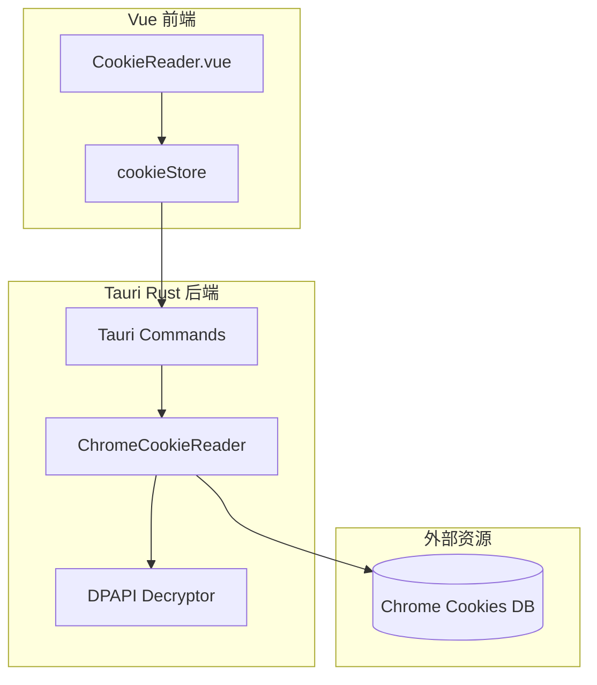

# Design Document: Chrome Cookie Reader

## Overview

本功能为 Tauri 桌面应用添加从本地 Chrome 浏览器读取 Cookie 的能力。系统通过 Rust 后端直接读取 Chrome 的 SQLite Cookie 数据库，使用 Windows DPAPI 解密加密的 Cookie 值，并通过 Vue 前端展示和导出数据。

## Architecture



## Components and Interfaces

### 1. Rust 后端模块

#### ChromeCookieReader
- 定位 Chrome Cookie 数据库路径：`%LOCALAPPDATA%\Google\Chrome\User Data\Default\Network\Cookies`
- 复制数据库到临时目录（避免 Chrome 锁定问题）
- 使用 rusqlite 读取 SQLite 数据库
- 调用 DPAPI 解密 Cookie 值

#### Tauri Commands
```rust
#[tauri::command]
async fn read_chrome_cookies(domain: String) -> Result<Vec<Cookie>, String>

#[tauri::command]
fn get_chrome_profile_path() -> Result<String, String>
```

### 2. Vue 前端组件

#### CookieReader.vue
- URL 输入框和读取按钮
- Cookie 数据表格展示
- 复制和导出功能

#### cookieStore (Pinia)
- 存储当前读取的 Cookie 列表
- 管理加载状态和错误信息

## Data Models

### Cookie 结构体 (Rust)
```rust
#[derive(Debug, Serialize, Deserialize, Clone)]
pub struct Cookie {
    pub name: String,
    pub value: String,
    pub domain: String,
    pub path: String,
    pub expires: Option<i64>,
    pub is_secure: bool,
    pub is_http_only: bool,
}
```

### Cookie 接口 (TypeScript)
```typescript
interface Cookie {
  name: string
  value: string
  domain: string
  path: string
  expires: number | null
  isSecure: boolean
  isHttpOnly: boolean
}
```

## Correctness Properties

*A property is a characteristic or behavior that should hold true across all valid executions of a system-essentially, a formal statement about what the system should do. Properties serve as the bridge between human-readable specifications and machine-verifiable correctness guarantees.*

### Property 1: Domain filtering correctness
*For any* domain query and cookie database, all returned cookies SHALL have a domain that matches or is a subdomain of the queried domain.
**Validates: Requirements 1.1**

### Property 2: Cookie data completeness
*For any* successfully retrieved cookie, the returned data SHALL contain non-empty name, domain, and path fields.
**Validates: Requirements 1.2**

### Property 3: Value truncation preserves data
*For any* cookie value string, truncating for display and then expanding SHALL return the original complete value.
**Validates: Requirements 3.3**

### Property 4: Export round-trip consistency
*For any* list of cookies, exporting to JSON and parsing back SHALL produce an equivalent list of cookies.
**Validates: Requirements 4.1, 4.2**

## Error Handling

| 错误场景 | 错误码 | 用户提示 |
|---------|-------|---------|
| Chrome 未安装 | CHROME_NOT_FOUND | 未检测到 Chrome 浏览器 |
| Cookie 数据库不存在 | DB_NOT_FOUND | Cookie 数据库不存在 |
| 数据库被锁定且复制失败 | DB_LOCKED | Chrome 正在运行，无法访问 Cookie |
| DPAPI 解密失败 | DECRYPT_FAILED | Cookie 解密失败 |
| 域名无匹配 Cookie | NO_COOKIES | 该域名下没有 Cookie |

## Testing Strategy

### 单元测试
- 域名匹配逻辑测试
- Cookie 数据解析测试
- JSON 导出格式测试

### 属性测试
使用 `proptest` (Rust) 进行属性测试：
- 配置每个属性测试运行至少 100 次迭代
- 每个属性测试需标注对应的 Correctness Property

测试标注格式：
```rust
// **Feature: chrome-cookie-reader, Property 1: Domain filtering correctness**
```

### 集成测试
- 端到端 Cookie 读取流程测试（使用模拟数据库）
